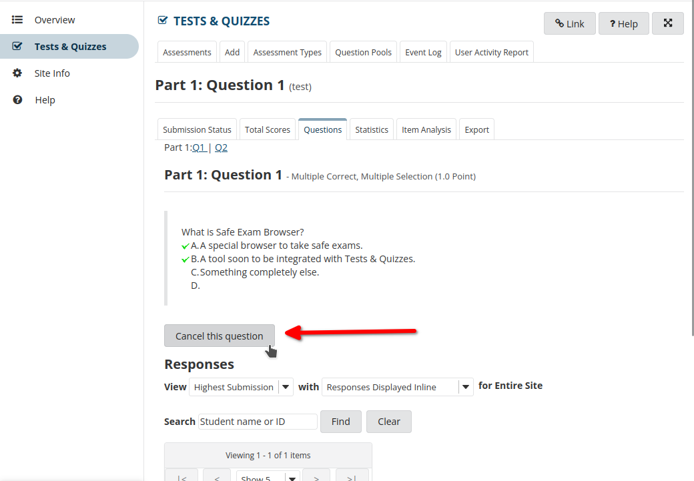
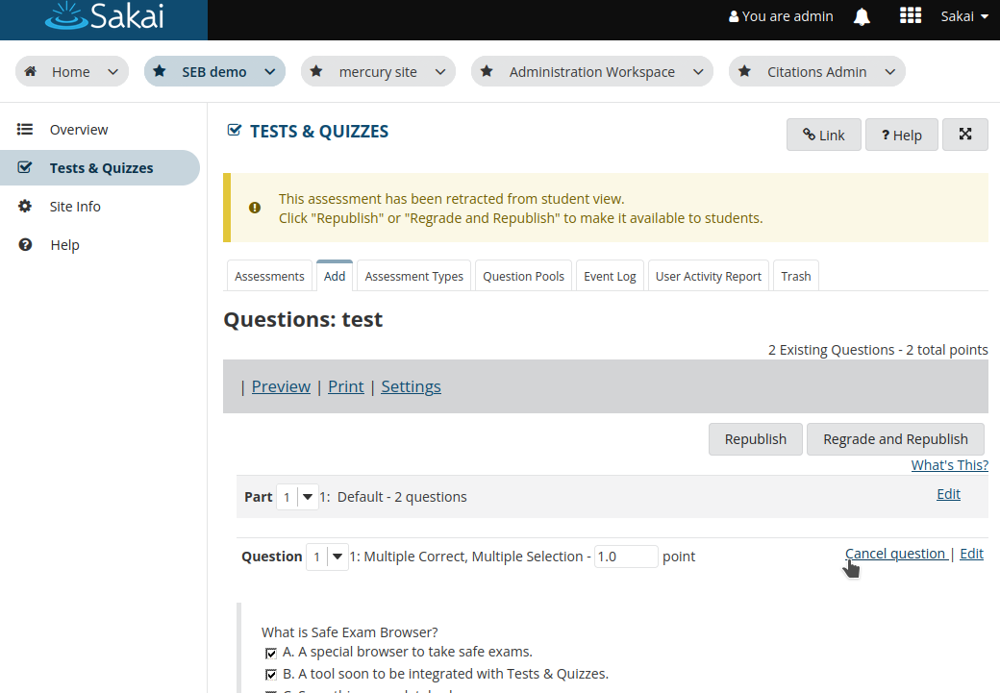
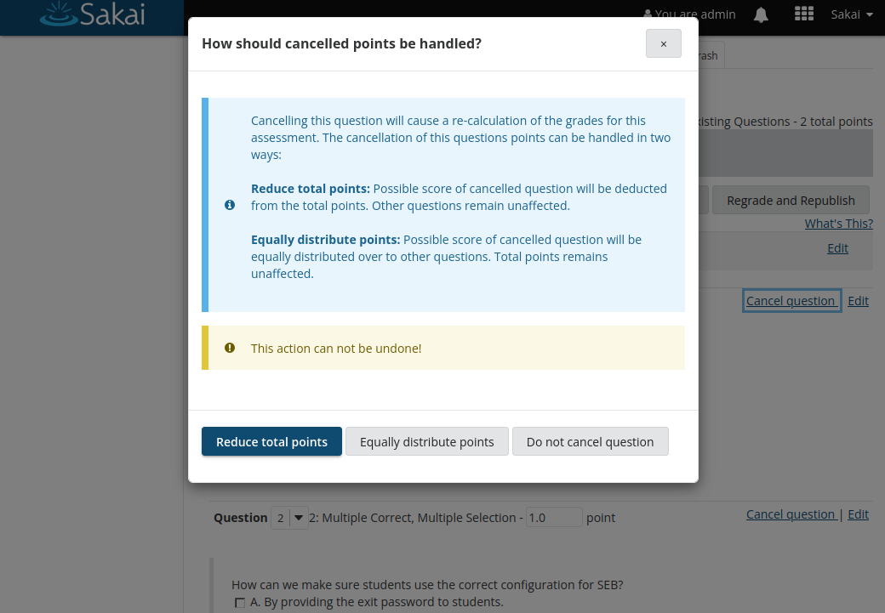
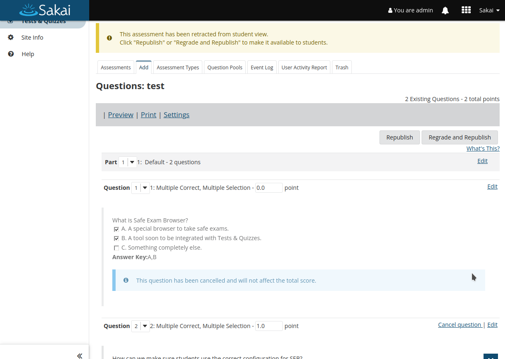
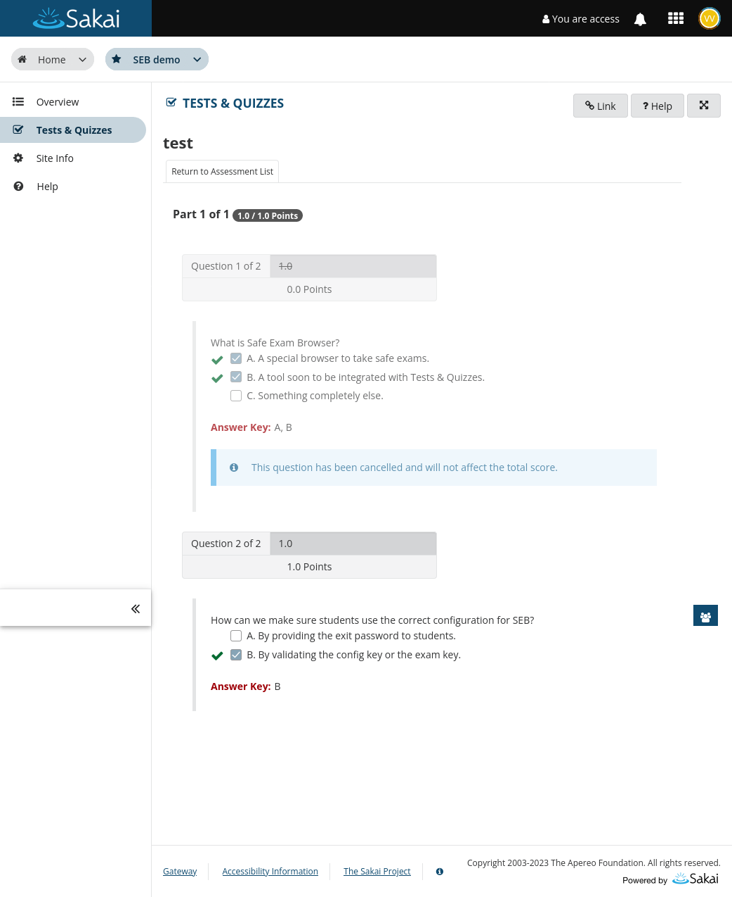

# Cancelled questions and score re-calculation prototype

## Cancelling questions

A "Cancel Question" button is added to the UI at Assessment -> Scores -> Questions.

A "Cancel Question" action is added next to "Edit" when re-publishing the Assessment.

In each view, clicking the button will brig up an modal informing about both ways how to handle points associated with the question being cancelled.

When the question is cancelled, it will not display the "Cancel Question" button and the
question will have reduced opacity. Also the points are set to 0 and the input is disabled.

## Student feedback with cancelled questions

Students will still see questions that are cancelled in the assessment feedback. To show, that this question is cancelled it has reduced opacity
and an info banner, noting, that this question has been cancelled and that it will not affect the total score.

