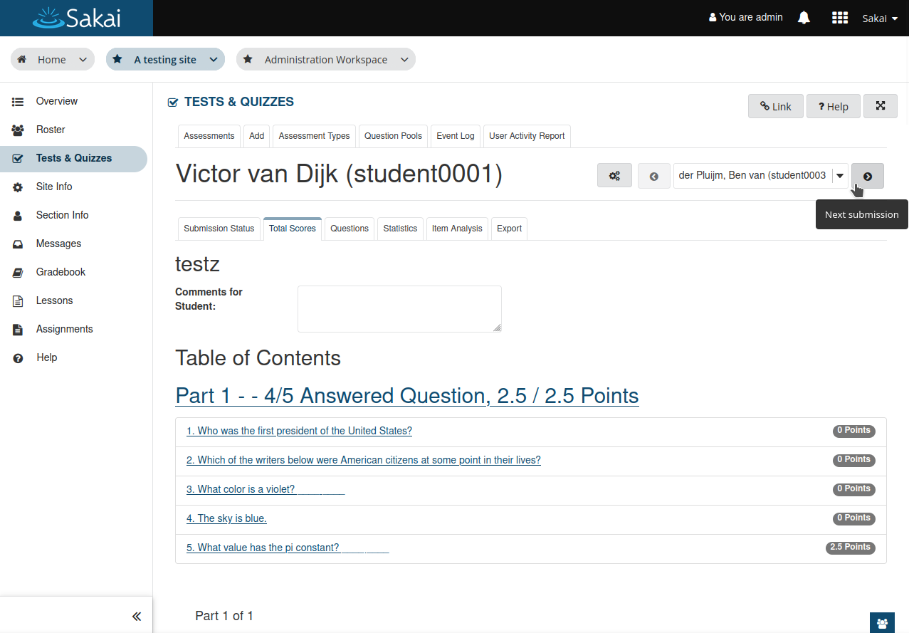
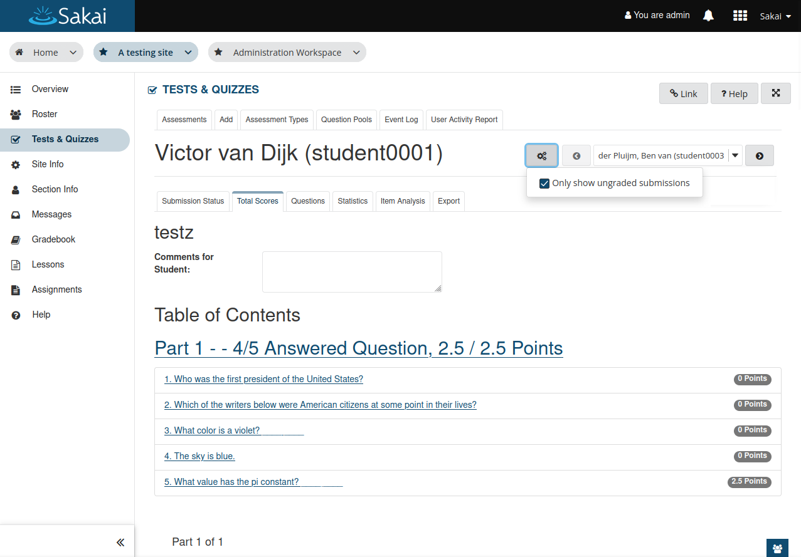

# Tests & Quizzes: Improve navigation when grading

The grading page (at total scores tab) should have navigation to browse submissions of
multiple students, similar to the navigation in the assignments tool using the sakai grader.

The new navigation has a small settings menu with the option that the sakai grader has as
well: "Only show ungraded submissions".

