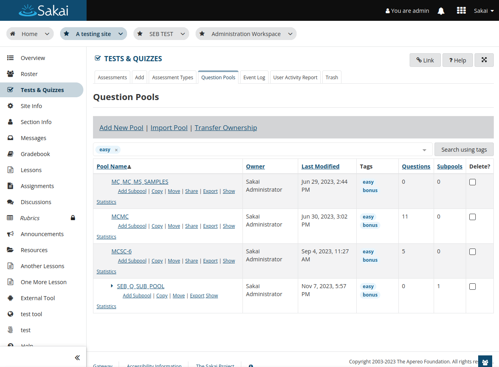

# Tests & Quizzes: Sorting question pools by folders and usage statistics

A new column is added to the question pool table that displays all the tags the question pool is associated
with. It is also possible to use the input above the table to filter by tags. If there are sub pools, when any
of the parent or sub pool matches the the searched tag, all pools of this branch will display. 

Tags can be added to question pools by clicking on them in the table and assigning tags in the Add/remove
tags section.

A new action is added for each question pool and sub pool to "Show Statistis", this opens a modal and
show statistis of this question pool and it's questions.

