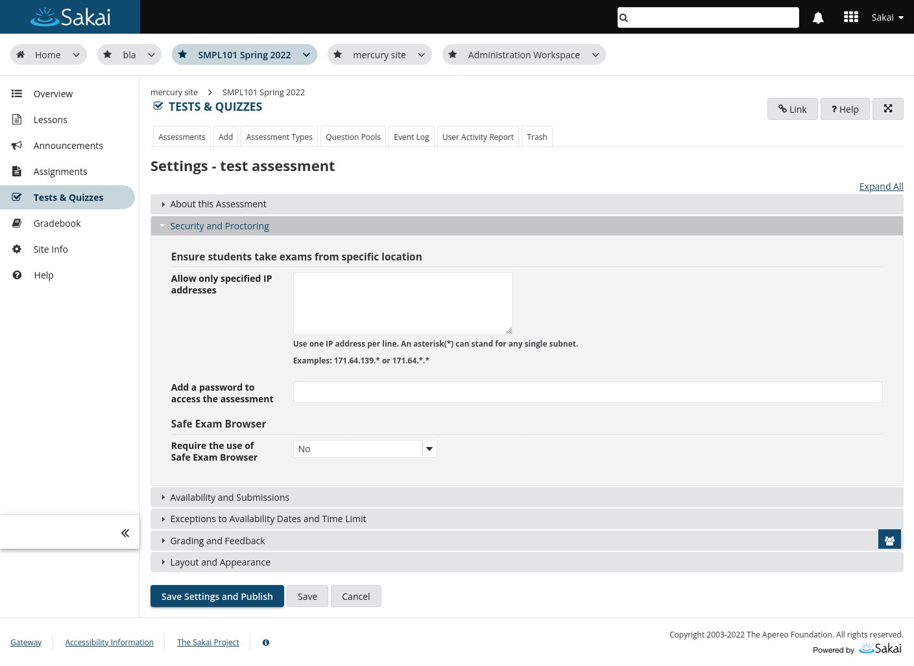
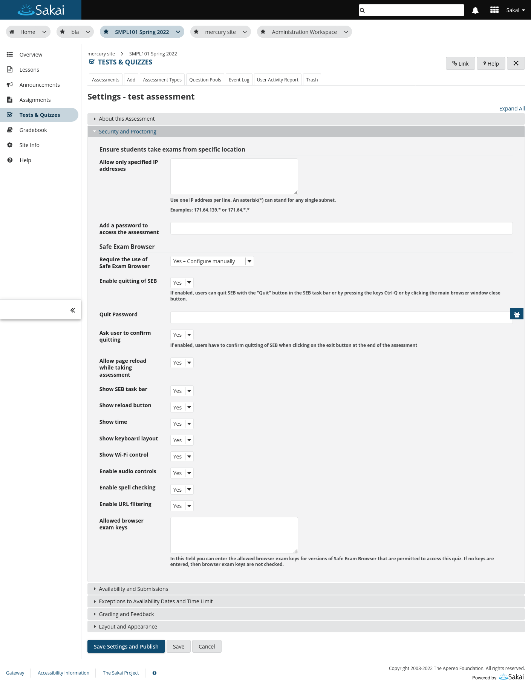
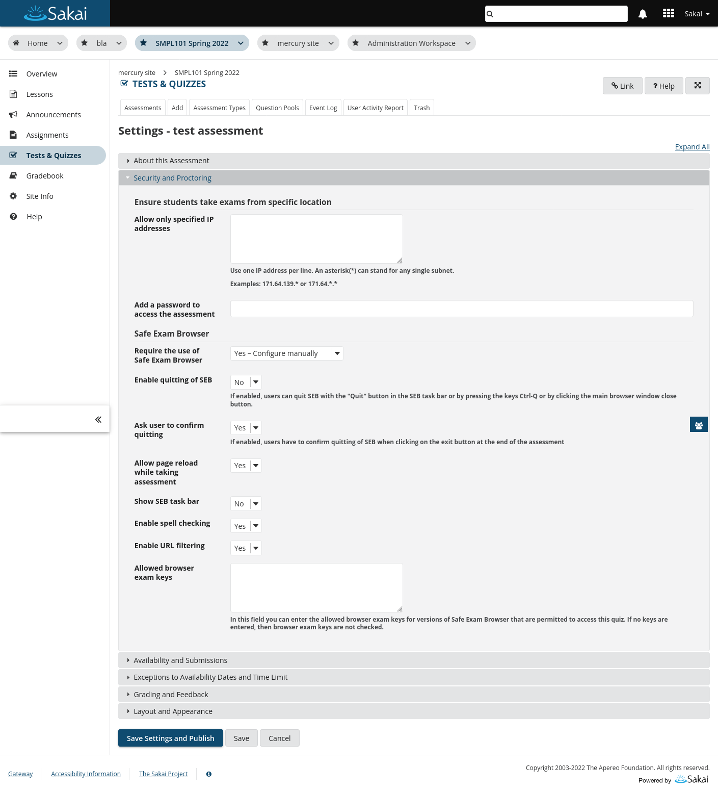
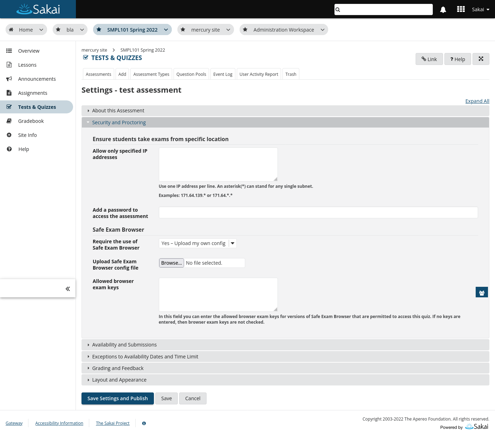
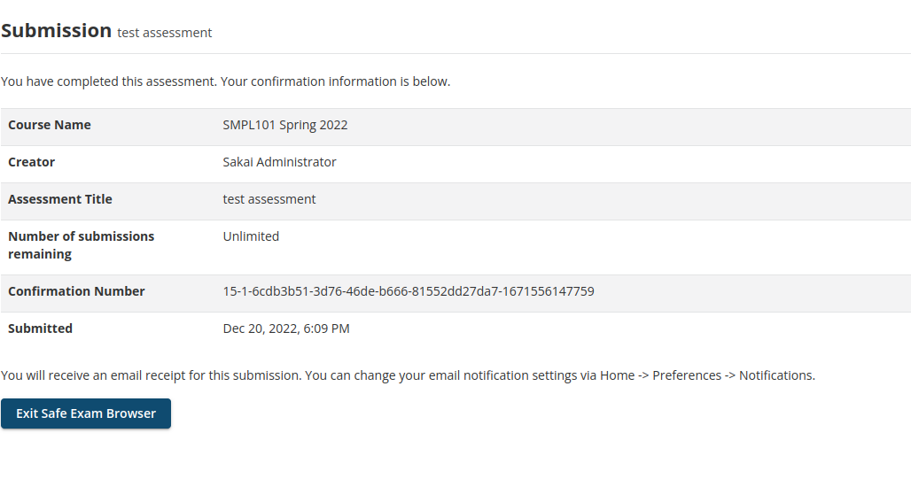
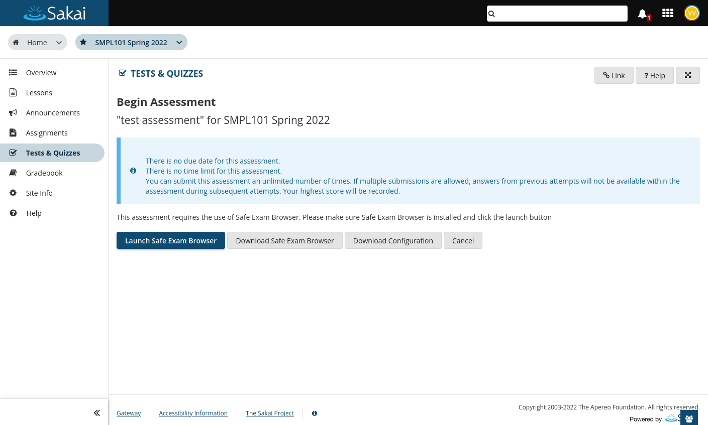
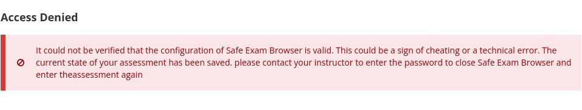

# Safe Exam Browser Sakai integration prototype

## Assessment settings

To configure the capabilities of SEB for an assessment, several options are added to the Security and Proctoring sections in the assessment settings. By default only the "Require Safe Exam Browser" option is displayed. Changing it will reveal more options.

Some options depend on others to be enabled and will be hidden, when the option they depend on is disabled. For example "Quit Password" depends on "Enable quitting of SEB" to be enabled and will be hidden if it's set to "No".

## Submissions

When the assessment is finished within Safe Exam Browser, the student can exit it by clicking the "Exit Safe Exam Browser" button.

## Begin assessment view

Student opens assessment that is restricted to Safe Exam browser, with regular browser. If the student has SEB installed already, the "Launch Safe Exam Browser" button can be used, otherwise the "Download Safe Exam Browser" button will open the download page of SEB in a new tab. The Download configuration button will download the SEB configuration file. This file can be executed, if SEB is installed and will launch the assessment.

## Access denied view

When the config or exam key can not be validated successfully, while the assessment is already in progress, the student gets redirected this view, where no further navigation is possible.

## Taking a look at the prototype within Sakai

To try the prototype in Sakai follow the instructions in the comments in the Javascript code within the following files:

* [assessment-settings.js](code/assessment-settings.js)
* [begin-assessment.js](code/begin-assessment.js)
* [submission.js](code/submission.js)

> **Note**
> This will just create the views as they are displayed in the screenshots, but won't add functionality.
