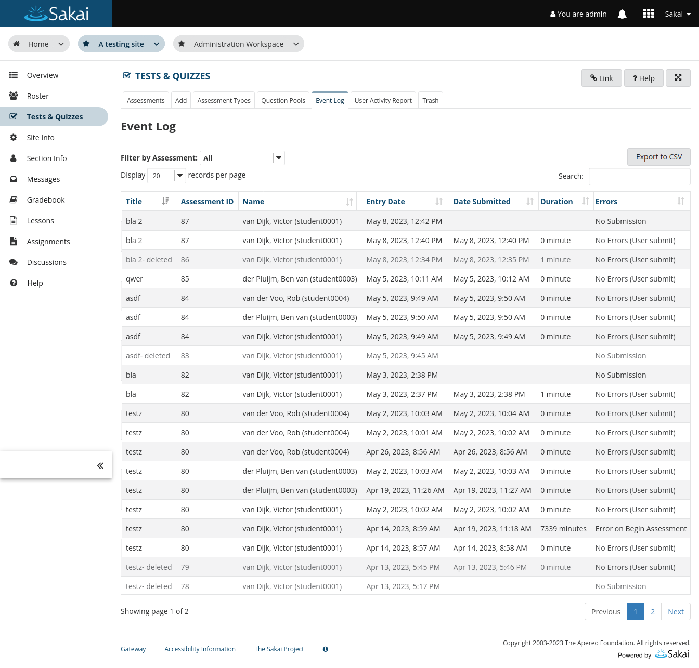

# Tests & Quizzes: Improve event log UI

The user interface of the event log tab gets several improvements:
1. Export to CSV button - will export the results based on the "Filter
   by Assessments" into CSV format for download.
2. The table can be searched and will be update as the search text is typed
3. The number of table rows can be selected
4. A proper pagination menu is added on the bottom of the table (Not just
   Previous and Next buttons)
5. Sorting of the duration column is possible

