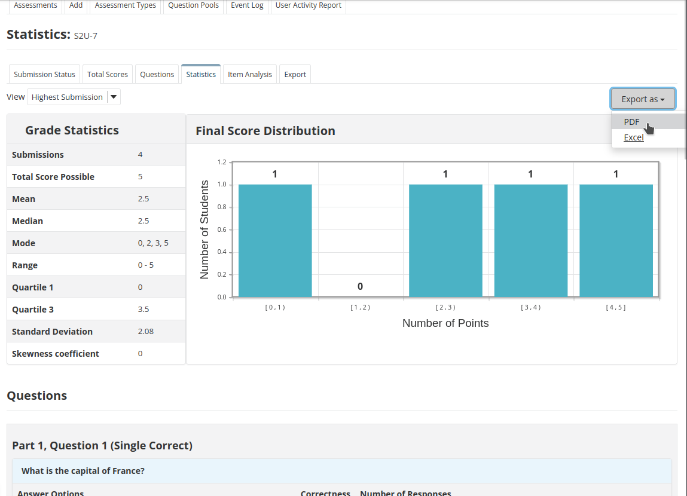
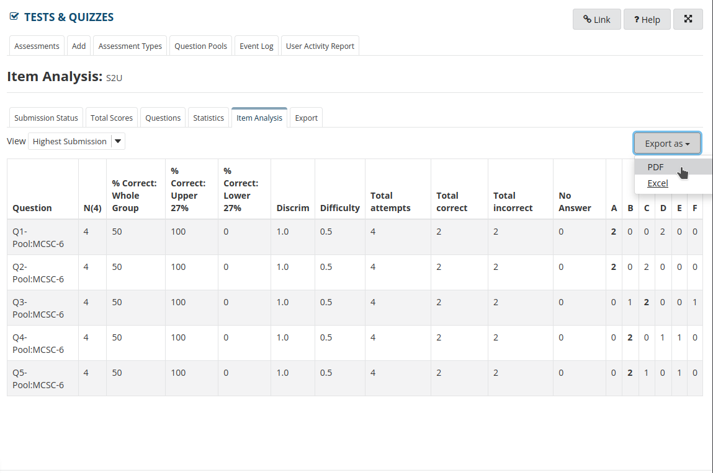

# Tests & Quizzes: Assessment report

In the statistics tab of a particular assessment the skewness coefficient is added below the
standard deviation.

[Export PDF example](pdf/statistics.pdf)

[Export XLSX example](xlsx/statistics.xlsx)

In the item analysis tab there are new columns added to the table: Discrim, Difficulty, Total
attempts, Total correct and Total incorrect.
Also an export option is added for both Microsoft Excel and PDF files.

[Export PDF example](pdf/item-analysis.pdf)

[Export XLSX example](xlsx/item-analysis.xlsx)
