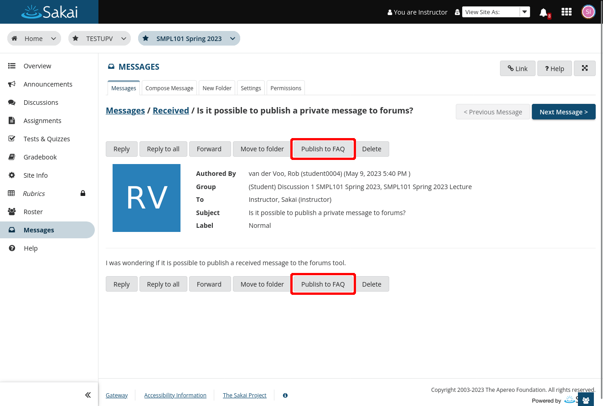
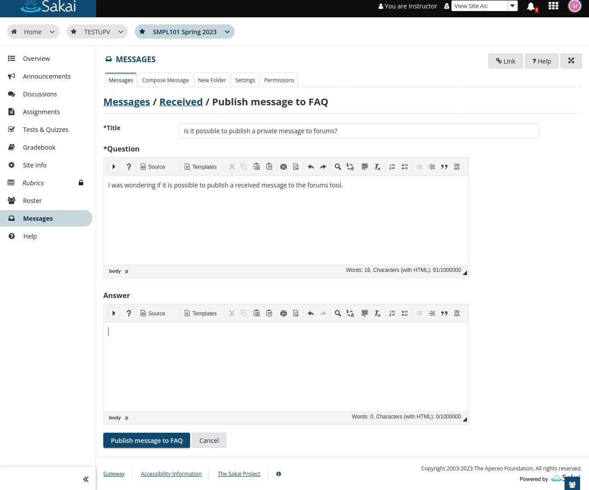
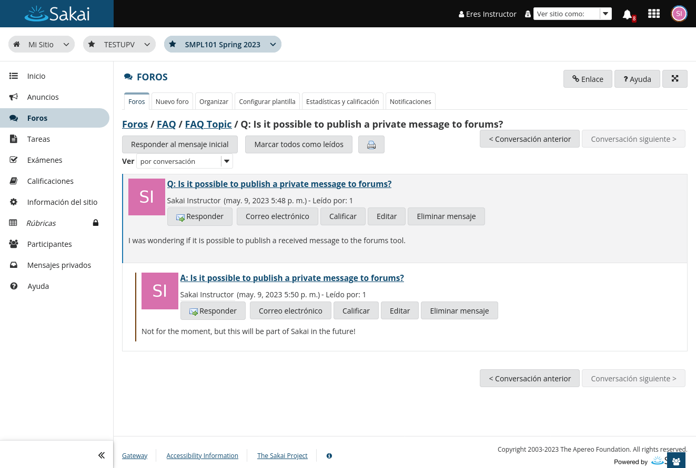

# Messages: Convert a private message into a forum message in the FAQ forum

When viewing a received message a new button is displayed to publish the message to an
automatically created forum called FAQ. This button is not available if the Discussions
tool is not present on the page or if necessary permissions are missing.

Clicking the button will open a new view, with title and question automatically populated
based on the message. Optionally, an answer can be added directly. If left empty, no answer
post is made.

When the "Publish to FAQ" button is clicked, a new discussion will be created under the FAQ
forum and topic, which is created, on the first post. The answer post will display as the
response of the question post.

