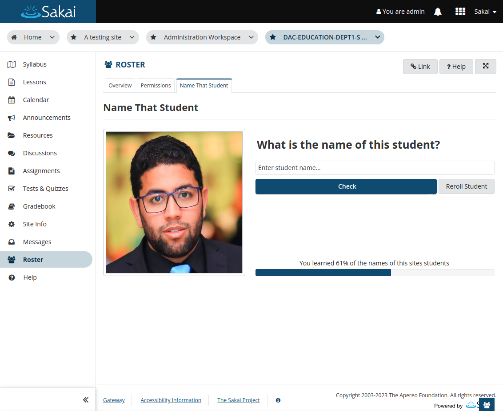
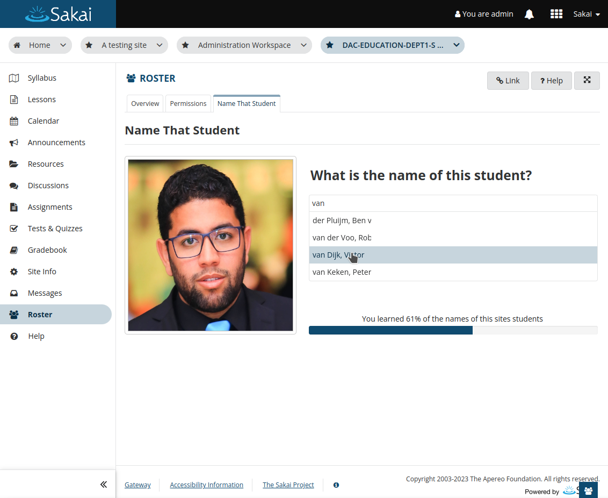
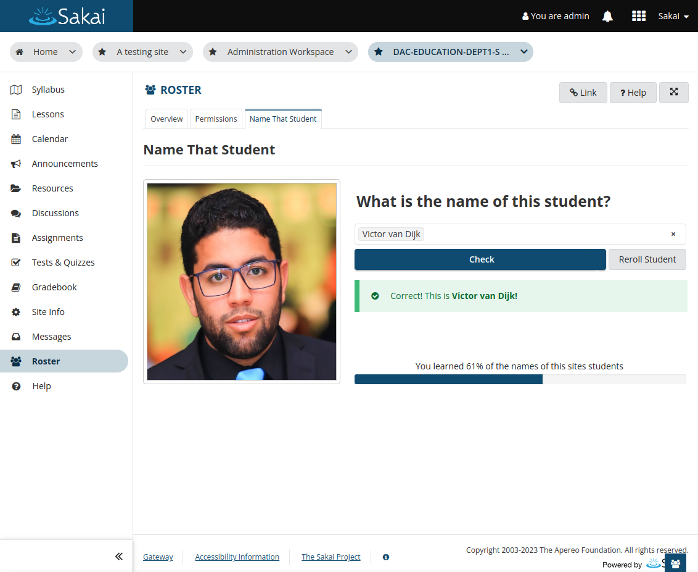
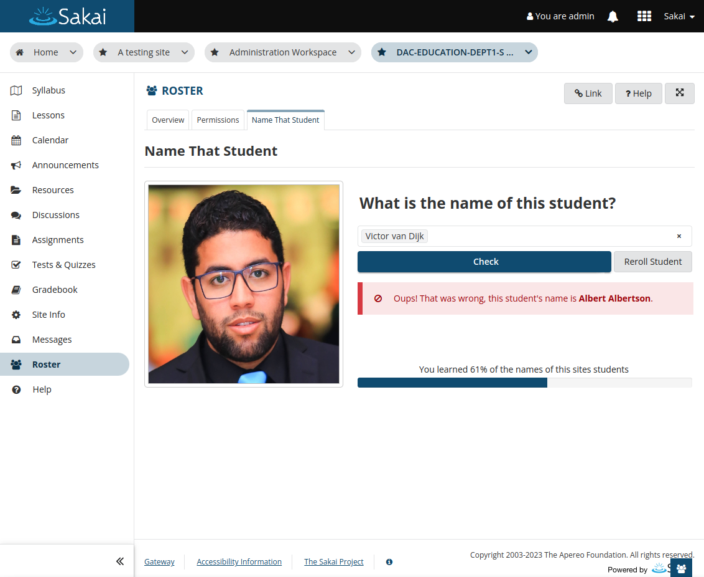
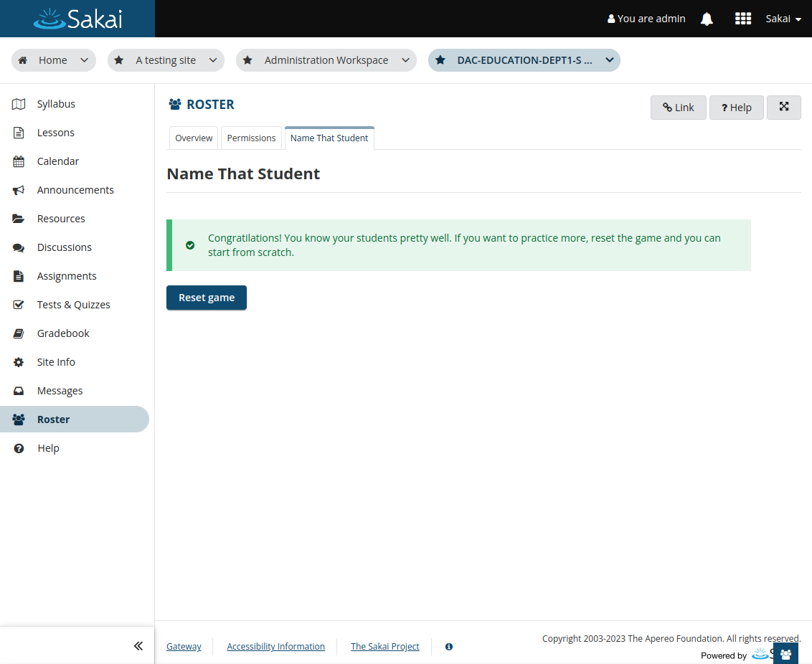
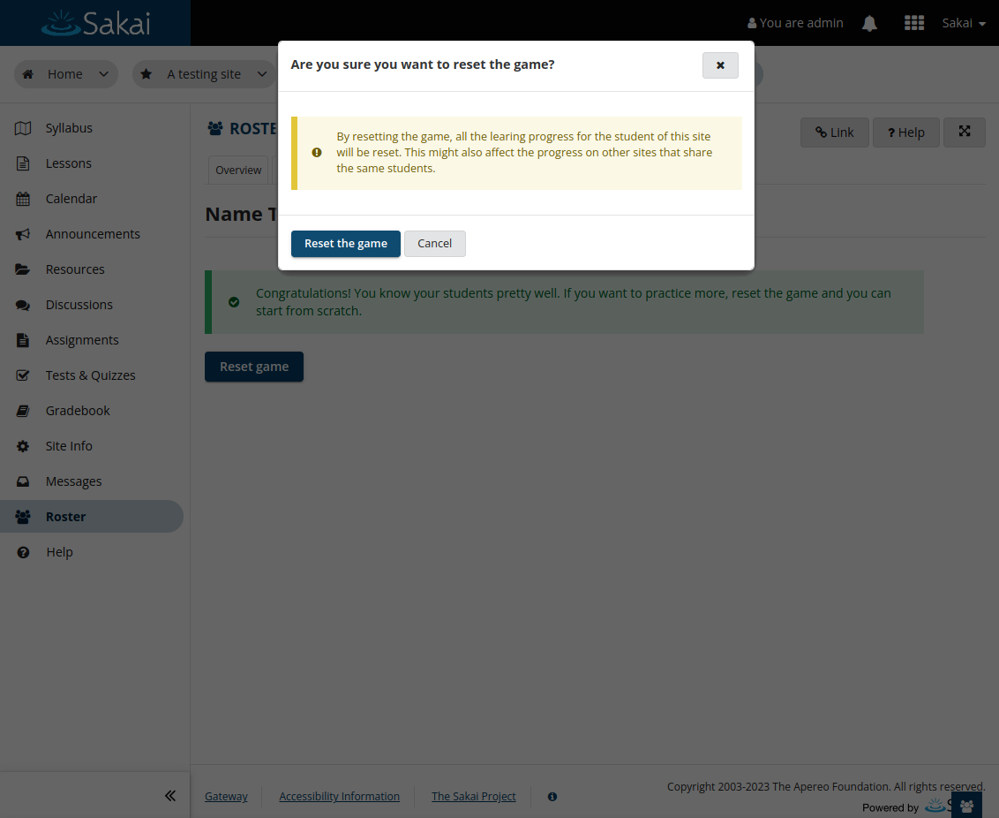
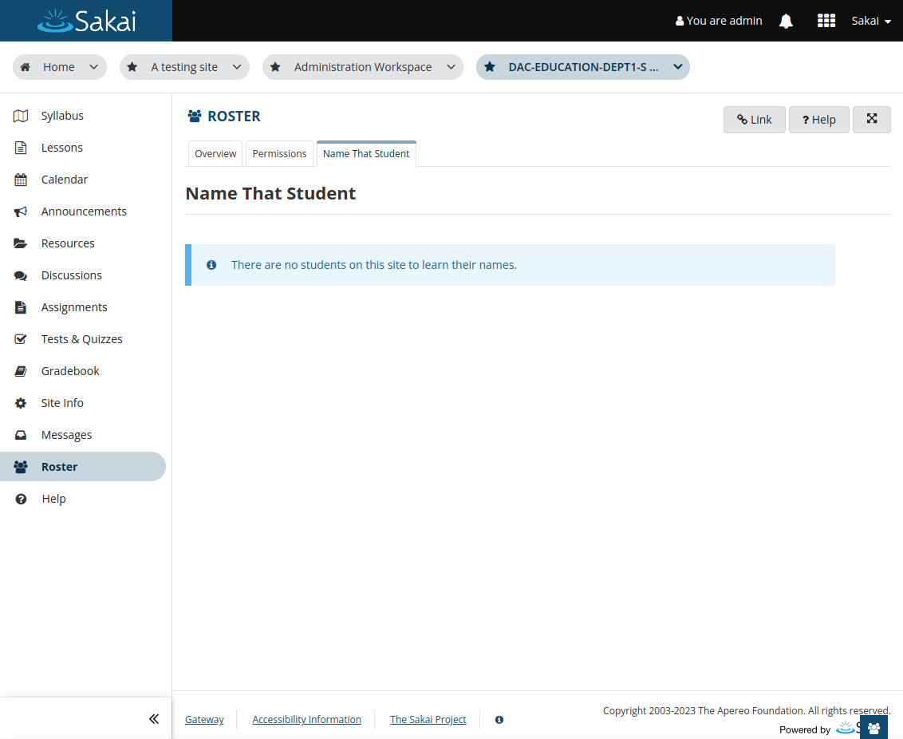

# The card game in roster: Name that Student

When opening the game the instructor will see a photo of one of the sites students.
The instructor has to start guess the name of the displayed students by entering the
name in the textbox. A progress bar shows the progress of learned names.

Names are suggested based on the input and can be selected without typing the full name.

After the name is entered/selected the Check button can be clicked and the name will be
checked and feedback is shown. After a short time the next student will be shown.

After all student names have been learned, a banner displays congratulating for learning
all of the names. A button is displayed to reset the game and start all over.

When the reset button is clicked a confirmation modal will display.

If there are no students on the site, a banner is displayed, informing about that.

